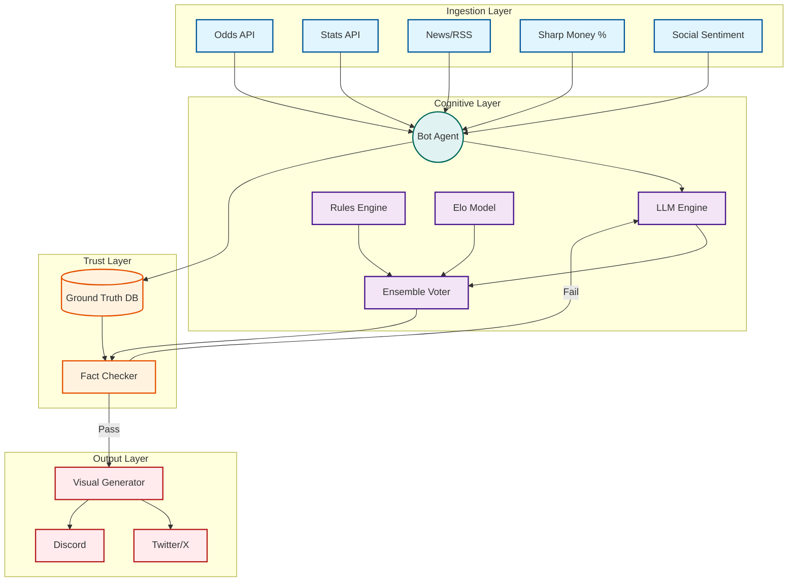
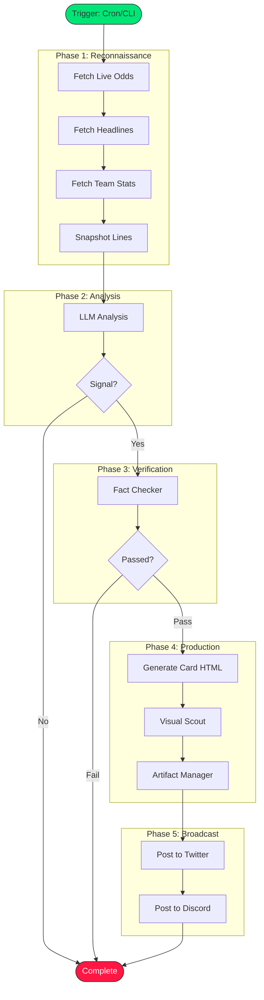

<div align="center">
  
</div>

# Specter Sports Intelligence

> **Deterministic RAG & Real-Time Verification for Sports Analytics**

[](https://github.com/shifujosh/Specter-Sports-Intel/actions/workflows/ci_validation.yml)

A cognitive sports analytics engine that solves the "hallucination problem" in LLMs when dealing with numerical sports data. The system introduces a **Verification Layer** that forces LLM outputs to pass deterministic truth checks against raw data before broadcast.

---

## The Problem

LLMs are notoriously unreliable with numbers. Ask an AI about sports statistics and you'll get confident, fluent, and often *completely wrong* answers. In sports betting, a single hallucinated stat can cost real money.

```text
USER: What's the spread for Lakers vs Celtics tonight?
LLM:  Lakers -3.5 at home. [WRONG - it's actually Celtics -7.5]
```

## The Solution

Specter introduces a **multi-stage verification architecture** that:

1. **Grounds** all LLM responses in real-time data from authoritative sources
2. **Verifies** generated content against SQL ground truth before output
3. **Rejects** factually incorrect statements and forces regeneration
4. **Ensembles** multiple prediction models for consensus-based recommendations

---

## Architecture



---


## Key Innovations

### 1. Deterministic Verification Layer

The **Fact Checker** is not an LLM. It is a logic engine that parses the LLM's structured JSON output and queries the ground truth database directly.

```typescript
// Simplified verification flow
const llmOutput = await llm.generate(prompt);
const groundTruth = await db.query("SELECT * FROM games WHERE id = ?", gameId);

if (llmOutput.claimedSpread !== groundTruth.spread) {
  return { 
    passed: false, 
    issue: "Spread mismatch", 
    regenerate: true 
  };
}
```

### 2. Ensemble Voting System

No single model is trusted. Three independent prediction systems must agree:

| Model | Weight | Description |
|-------|--------|-------------|
| **Bayesian** | 33% | Bradley-Terry win probability with calibrated confidence |
| **Elo** | 33% | Dynamic team ratings with home-court adjustment |
| **Rules Engine** | 33% | Situational filters (rest, travel, schedule spots) |

```
ENSEMBLE: BET (58.2%) | 2/3 models agree BET
  BAYES: 55.8% | BET (medium)
  ELO: 60.1% | HOME (high)
  RULES: 58.5% | BET (medium)
```

### 3. Rules Engine (Defensive Filters)

Hard-coded situational handicapping rules that override LLM recommendations:

- **Rest Disadvantage**: 0-day rest vs 2+ days = automatic penalty
- **Public Fade**: >70% public betting with no sharp confirmation = fade trigger
- **Travel B2B**: Cross-country back-to-back = significant penalty
- **Letdown Spot**: Heavy favorite after big win = trap game warning

### 4. Temporal Awareness

The **Temporal Engine** tracks time-based factors:

- Rest days and fatigue scores
- Schedule spots (B2B, 3-in-4, 4-in-5)
- Circadian disruption (west coast team traveling east for early game)
- Season phase and playoff positioning

### 5. Line Velocity Tracking

The **Velocity Tracker** monitors betting line movements:

```
VELOCITY: Spread moved 1.5 pts toward HOME in 4.2h
**STEAM MOVE DETECTED: HOME** | Late movement detected (last 2h)
```

---

## Technology Stack

| Component | Technology | Purpose |
|-----------|------------|---------|
| **Runtime** | TypeScript, Node.js | Type-safe async operations |
| **LLM** | Google Gemini 2.5 | Fast inference with structured output |
| **Database** | Firebase Firestore | Real-time sync, paper trading history |
| **Validation** | Zod | Runtime schema validation |
| **Visual** | Puppeteer + HTML/CSS | PNG generation from HTML templates |
| **Output** | Twitter API v2, Discord Webhooks | Multi-platform broadcast |

---

## System Flow



---

## Component Overview

### Ingestion Layer

| Connector | Source | Data |
|-----------|--------|------|
| **OddsScraper** | ESPN/CBS | Spreads, totals, moneylines |
| **StatsConnector** | BallDontLie, nba_api | Team/player stats, H2H history |
| **NewsScraper** | RSS Feeds | Injury reports, narratives |
| **SharpScraper** | TheSpread.com | Public betting percentages |
| **SocialConnector** | Reddit, X | Sentiment analysis |

### Cognitive Layer

| Component | Function |
|-----------|----------|
| **BotAgent** | Central orchestrator, manages the analysis loop |
| **LLM Engine** | Gemini 2.5 with structured output schemas |
| **Elo Model** | Standard Elo with home-court and MOV adjustments |
| **Rules Engine** | Situational filters and penalties |
| **Ensemble Voter** | Aggregates models, requires 2/3 consensus |
| **Temporal Engine** | Fatigue, rest, circadian analysis |
| **Velocity Tracker** | Line movement and steam detection |

### Trust Layer

| Component | Function |
|-----------|----------|
| **Fact Checker** | Validates LLM output against ground truth |
| **Ground Truth DB** | Firebase with normalized game data |

### Output Layer

| Component | Function |
|-----------|----------|
| **Visual Generators** | MatchCard, LeagueBrief, SnipeCard, HypeCard |
| **Visual Scout** | Puppeteer-based HTML to PNG conversion |
| **Artifact Manager** | File storage with timestamped naming |
| **Broadcasters** | Twitter API v2, Discord webhooks |

---

## Documentation

- [Architecture Details](docs/ARCHITECTURE.md) - Component deep-dive
- [Verification Layer](docs/VERIFICATION.md) - How facts are checked
- [Ensemble System](docs/ENSEMBLE.md) - Multi-model voting
- [ADR: Ensemble Voting](docs/adr/001-ensemble-voting.md) - Why 2/3 consensus
- [ADR: Verification First](docs/adr/002-verification-first.md) - Why we verify before output
- [ADR: Rules Engine](docs/adr/003-rules-engine.md) - Situational handicapping

---

## Project Structure

```
src/
├── logic/                  # Core intelligence
│   ├── ensemble-voter.ts   # Multi-model consensus
│   ├── rules-engine.ts     # Situational filters
│   ├── elo-model.ts        # Rating system
│   ├── fact-checker.ts     # Verification agent
│   ├── temporal-engine.ts  # Time-based analysis
│   └── velocity-tracker.ts # Line movement
├── connectors/             # Data ingestion
│   ├── odds-scraper.ts     # Betting lines
│   ├── stats-connector.ts  # Team/player data
│   └── ...
├── generators/             # Visual output
│   ├── match-card.ts       # Game cards
│   ├── league-brief.ts     # Daily summaries
│   └── ...
├── types/                  # Type definitions
└── agent.ts                # Central orchestrator
```

---

## Philosophy

> **"Never trust the LLM with numbers."**

Every claim is verified. Every recommendation requires consensus. Every output passes through the Trust Layer.

The system is designed to fail safely: if verification fails, we regenerate or stay silent rather than broadcast incorrect information.

---

## License

MIT License - See [LICENSE](LICENSE)

---

> **Note:** This repository demonstrates the verification architecture. Source code is proprietary.

**[Back to Profile](https://github.com/shifujosh)**
