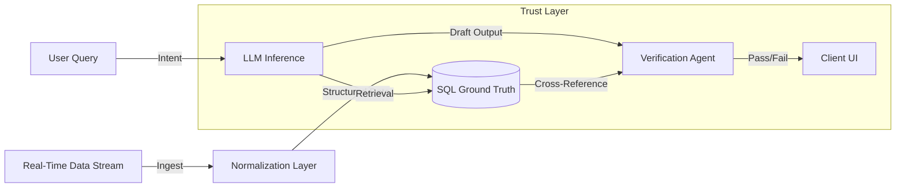

# Specter-Sports-Intel
Deterministic RAG & Real-Time Ingestion
> **Note:** Source code is proprietary. This repository demonstrates the verification architecture.
Specter Sports Intel is a real-time analytics engine that solves the "hallucination problem" in LLMs when dealing with numerical sports data. It introduces a **Verification Layer** that forces LLM outputs to pass a deterministic truth check against raw SQL data before being presented to the user.
## The Verification Flow

## Key Innovations
### 1. Vector Anchors
We do not feed raw stats to the LLM context blindly. We use "Anchor Embeddings" to retrieve only the relevant game state rows, reducing context window noise.
### 2. Deterministic Logic Gates
The **Verification Agent** is not an LLM. It is a logic engine that parses the LLM's JSON output and queries the SQL database directly. 
- If `LLM says "Player scored 30"` AND `DB says "Player scored 20"` -> **REJECT & REGENERATE**.
### 3. Real-Time Ingestion
Data is normalized from multiple firehose providers (Sportradar, Genius) and normalized into a unified schema within sub-milliseconds.
