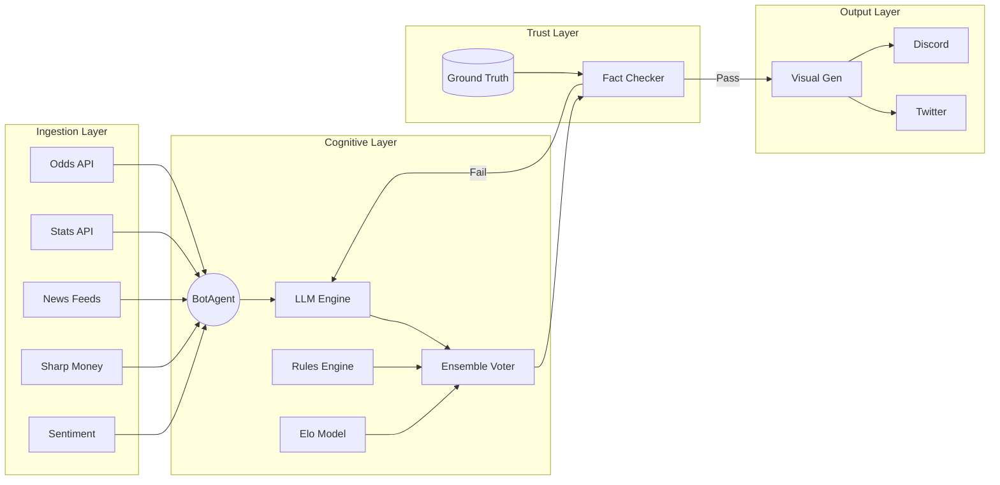
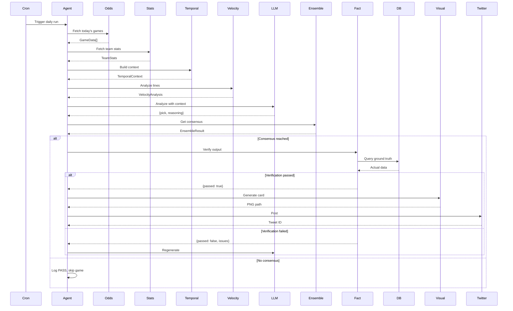

# Architecture

Specter Sports Intelligence is a cognitive sports analytics engine built for accuracy over speed. This document describes the system architecture, data flow, and key components.

---

## System Overview

The system follows a **linear verification pipeline**: ingest, analyze, verify, produce, broadcast. No output is emitted without passing the Trust Layer.



---

## Ingestion Layer

### Data Sources

| Connector | Primary Source | Fallback | Data |
|-----------|---------------|----------|------|
| **OddsScraper** | ESPN API | CBS Sports | Spreads, totals, MLs, scores |
| **StatsConnector** | BallDontLie | nba_api | Team stats, player data |
| **NewsScraper** | ESPN RSS | Yahoo Sports | Injury reports, narratives |
| **SharpScraper** | TheSpread.com | - | Public betting percentages |
| **SocialConnector** | Reddit API | - | Sentiment from r/nba, r/nfl |
| **WeatherConnector** | OpenWeather | - | Outdoor game conditions |

### Normalization

All data is normalized into a unified `GameData` schema:

```typescript
interface GameData {
  id: string;
  league: 'NBA' | 'NFL' | 'NCAAF' | 'NCAAB';
  homeTeam: string;
  awayTeam: string;
  time: string;          // ISO 8601
  spread: number;        // Negative = home favored
  total: number;
  homeML: number;
  awayML: number;
  publicBetPct?: number;
  sharpAction?: boolean;
}
```

---

## Cognitive Layer

### BotAgent

The central orchestrator that manages the analysis loop:

1. **Fetch**: Gather data from all connectors
2. **Enrich**: Add temporal context, line velocity, social sentiment
3. **Analyze**: Send to LLM with structured output schema
4. **Validate**: Run through ensemble voter
5. **Verify**: Check facts against ground truth
6. **Produce**: Generate visual assets
7. **Broadcast**: Post to Twitter/Discord

### LLM Engine

Uses Google Gemini 2.5 with structured output schemas:

```typescript
const schema = {
  type: "OBJECT",
  properties: {
    pick: { type: "STRING" },
    reasoning: { type: "STRING" },
    confidence: { type: "NUMBER" },
    key_factors: { type: "ARRAY", items: { type: "STRING" } }
  },
  required: ["pick", "reasoning", "confidence"]
};

const result = await generateStructuredContent(prompt, schema);
```

### Elo Model

Standard Elo rating system with adjustments:

- **Home Court**: +100 Elo points (~3-4 point spread equivalent)
- **K-Factor**: 20 (moderate sensitivity to new results)
- **MOV Multiplier**: Up to 2x for blowout wins

```
ELO: Lakers 1495 vs Celtics 1650
Predicted: 61.3% AWAY | Margin: -6.2 | REC: AWAY
```

### Rules Engine

Defensive filter system with hard constraints:

| Rule | Trigger | Penalty |
|------|---------|---------|
| **Rest Disadvantage** | 0 days rest vs 2+ | -3 to -5 points |
| **Public Fade** | >70% public, no sharp | Auto-FADE |
| **Travel B2B** | Cross-country + back-to-back | -4 points |
| **Trap Game** | Big favorite after statement win | WARNING |
| **Letdown Spot** | Heavy favorite, late season | -2 points |
| **Fatigue** | 3-in-4 or 4-in-5 schedule | Graduated penalty |
| **Circadian** | West coast early game east | -2 points |

### Ensemble Voter

Combines three models with majority vote requirement:

```typescript
interface EnsembleResult {
  votes: ModelVote[];
  consensus: boolean;
  finalRecommendation: 'STRONG_BET' | 'BET' | 'LEAN' | 'PASS' | 'FADE' | 'BLOCKED';
  agreement: string;  // "2/3 models agree"
}
```

**Decision Matrix:**

| Bayes | Elo | Rules | Final |
|-------|-----|-------|-------|
| BET | BET | BET | STRONG_BET |
| BET | BET | PASS | BET |
| BET | PASS | PASS | LEAN |
| PASS | PASS | PASS | PASS |
| - | - | BLOCKED | BLOCKED |

### Temporal Engine

Time-based analysis across multiple dimensions:

```typescript
interface TemporalContext {
  schedule: {
    homeRestDays: number;
    awayRestDays: number;
    scheduleSpot: 'NORMAL' | 'B2B' | '3_IN_4' | '4_IN_5' | 'TRAVEL_B2B';
    fatigueScore: number;  // -10 to +10
  };
  circadian: {
    timeZoneShift: number;
    isEarlyGameForAway: boolean;
    circadianDisadvantage: 'HOME' | 'AWAY' | 'NONE';
  };
  seasonal: {
    seasonPhase: 'EARLY' | 'MID' | 'LATE' | 'PLAYOFF_PUSH';
    isPlayoffContender: { home: boolean; away: boolean };
  };
}
```

### Velocity Tracker

Monitors line movement to detect sharp money:

```typescript
interface VelocityAnalysis {
  spreadVelocity: number;     // pts/hour
  totalVelocity: number;
  isSteamMove: boolean;
  steamDirection: 'HOME' | 'AWAY' | 'OVER' | 'UNDER' | null;
  lateMovement: boolean;      // Last 2 hours
}
```

**Steam Detection:**
- Velocity threshold: 0.5 pts/hour
- Late movement window: 2 hours before game

---

## Trust Layer

### Fact Checker

The Fact Checker is a **deterministic logic engine**, not an LLM:

1. Parse LLM output (structured JSON)
2. Query ground truth database
3. Compare claimed values to actual values
4. Return pass/fail with specific issues

```typescript
interface ValidationResult {
  passed: boolean;
  issues: string[];
  corrected_text?: string;
}
```

**Verification Checks:**

| Check | Example |
|-------|---------|
| **Spread Match** | LLM says "-3.5", DB says "-7.5" → FAIL |
| **Team Identity** | LLM says "Lakers are home" but they're away → FAIL |
| **Date Consistency** | Says "Tonight" but game is tomorrow → FAIL |
| **Stat Plausibility** | Claims 50 PPG average → FAIL |

### Ground Truth Database

Firebase Firestore with normalized game data:

```typescript
// Collection: games
{
  id: "nba_lal_bos_20250102",
  league: "NBA",
  homeTeam: "Boston Celtics",
  awayTeam: "Los Angeles Lakers",
  spread: -7.5,
  total: 224.5,
  status: "scheduled",
  lastUpdated: Timestamp
}

// Collection: line_snapshots
{
  gameId: "nba_lal_bos_20250102",
  timestamp: Timestamp,
  spread: -7.5,
  total: 224.5
}
```

---

## Output Layer

### Visual Generators

| Generator | Output | Use Case |
|-----------|--------|----------|
| **MatchCard** | Game preview PNG | Individual game analysis |
| **LeagueBrief** | Daily summary PNG | Morning roundup |
| **SnipeCard** | Bet slip style PNG | Successful prediction celebration |
| **HypeCard** | Vertical mobile PNG | High-engagement social content |

### Visual Scout

Puppeteer-based screenshot engine:

1. Generate HTML from template
2. Launch headless Chrome
3. Set viewport to template dimensions
4. Capture PNG
5. Optimize and save

### Artifact Manager

Centralized file storage with naming convention:

```
public/brand/
├── match_cards/
│   └── nba_lal_bos_20250102_1704234500.png
├── briefs/
│   └── nba_daily_brief_20250102.png
└── snipes/
    └── specter_snipe_20250102_1704234500.png
```

### Broadcasters

| Platform | Method | Features |
|----------|--------|----------|
| **Twitter** | API v2 | Text + media, threads |
| **Discord** | Webhooks | Rich embeds, file attachments |

---

## Data Flow (Detailed)



---

## Configuration

### Environment Variables

```bash
GEMINI_API_KEY=...           # Google AI Studio
FIREBASE_PROJECT_ID=...      # Firestore
TWITTER_API_KEY=...          # Twitter API v2
TWITTER_API_SECRET=...
TWITTER_ACCESS_TOKEN=...
TWITTER_ACCESS_SECRET=...
DISCORD_WEBHOOK_URL=...      # Discord webhook
```

### Tunable Parameters

| Parameter | Default | Description |
|-----------|---------|-------------|
| `ELO_K_FACTOR` | 20 | Rating sensitivity |
| `ELO_HOME_ADVANTAGE` | 100 | Home court Elo boost |
| `ENSEMBLE_CONSENSUS` | 2/3 | Required model agreement |
| `STEAM_THRESHOLD` | 0.5 | pts/hour for steam |
| `PUBLIC_FADE_THRESHOLD` | 70% | Public % to trigger fade |
| `REST_PENALTY_THRESHOLD` | 2 | Days rest for penalty |

---

## Related Documentation

- [Verification Layer](VERIFICATION.md) - Deep dive on fact checking
- [Ensemble System](ENSEMBLE.md) - Multi-model voting details
- [ADR: Ensemble Voting](adr/001-ensemble-voting.md)
- [ADR: Verification First](adr/002-verification-first.md)
- [ADR: Rules Engine](adr/003-rules-engine.md)
