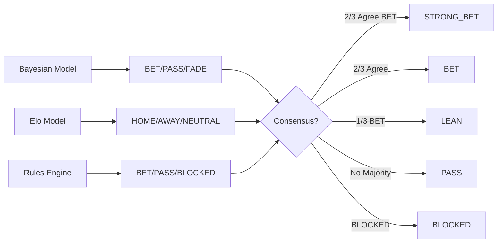

# Ensemble Voting System

The Ensemble Voter aggregates predictions from multiple independent models and requires consensus before recommending a bet. No single model is trusted; the system demands agreement.

---

## Philosophy

> **"One model is an opinion. Three models agreeing is a signal."**

LLMs are powerful but unreliable. Statistical models are rigorous but miss context. Rules are rigid but proven. By combining all three, we get the best of each world.

---

## The Three Models

### 1. Bayesian Win Probability (Bradley-Terry)

A calibrated probability model based on:
- Team performance metrics (offensive/defensive rating)
- Head-to-head historical data
- Recent form (last 10 games)

**Strengths:** Mathematically rigorous, well-calibrated probabilities
**Weaknesses:** Slow to adapt, misses narrative factors

### 2. Elo Rating System

Dynamic team ratings that update after each game:
- Standard Elo formula with home-court adjustment
- Margin of victory multiplier
- Recency weighting

**Strengths:** Adapts quickly, captures momentum
**Weaknesses:** No player-level granularity

### 3. Rules Engine (Situational Handicapping)

Hard-coded filters based on proven betting edges:
- Rest advantages (0 vs 2+ days)
- Schedule spots (back-to-back, 3-in-4)
- Public fade (>70% public with no sharp)

**Strengths:** Captures real-world factors models miss
**Weaknesses:** Binary (pass/fail), no probability

---

## Voting Mechanism



---

## Decision Matrix

| Bayes | Elo | Rules | Final | Note |
|-------|-----|-------|-------|------|
| BET | HOME | BET | **STRONG_BET** | Full consensus |
| BET | HOME | PASS | **BET** | 2/3 agree |
| BET | NEUTRAL | PASS | **LEAN** | Only 1/3 confident |
| PASS | NEUTRAL | PASS | **PASS** | No signal |
| BET | HOME | BLOCKED | **BLOCKED** | Rules override |
| FADE | AWAY | FADE | **FADE** | Consensus against |

---

## Implementation

### Types

```typescript
interface ModelVote {
  model: 'bayes' | 'elo' | 'rules';
  probability: number;
  recommendation: string;
  confidence: 'high' | 'medium' | 'low';
}

interface EnsembleResult {
  votes: ModelVote[];
  consensus: boolean;
  finalProbability: number;
  finalRecommendation: 'STRONG_BET' | 'BET' | 'LEAN' | 'PASS' | 'FADE' | 'BLOCKED';
  agreement: string;
  summary: string;
}
```

### Voting Logic

```typescript
class EnsembleVoter {
  static vote(
    bayesianProb: number,
    bayesianRec: string,
    eloProb: number,
    eloRec: string,
    rulesProb: number,
    rulesRec: string
  ): EnsembleResult {
    const votes: ModelVote[] = [
      { model: 'bayes', probability: bayesianProb, recommendation: bayesianRec, confidence: this.getConfidence(bayesianProb) },
      { model: 'elo', probability: eloProb, recommendation: eloRec, confidence: this.getConfidence(eloProb) },
      { model: 'rules', probability: rulesProb, recommendation: rulesRec, confidence: rulesRec === 'BLOCKED' ? 'high' : this.getConfidence(rulesProb) }
    ];
    
    // Check for blockers first
    if (votes.some(v => v.recommendation === 'BLOCKED')) {
      return { 
        votes, 
        consensus: true, 
        finalProbability: rulesProb,
        finalRecommendation: 'BLOCKED',
        agreement: 'BLOCKED by rules',
        summary: 'ENSEMBLE: BLOCKED - RulesEngine override'
      };
    }
    
    // Count votes
    const betVotes = votes.filter(v => 
      v.recommendation === 'BET' || v.recommendation === 'HOME'
    ).length;
    
    // Calculate weighted average
    const avgProb = votes.reduce((sum, v) => sum + v.probability, 0) / votes.length;
    
    // Determine consensus
    let finalRec: EnsembleResult['finalRecommendation'];
    if (betVotes >= 2 && avgProb > 0.60) finalRec = 'STRONG_BET';
    else if (betVotes >= 2) finalRec = 'BET';
    else if (betVotes === 1) finalRec = 'LEAN';
    else finalRec = 'PASS';
    
    return {
      votes,
      consensus: betVotes >= 2,
      finalProbability: avgProb,
      finalRecommendation: finalRec,
      agreement: `${betVotes}/3 models agree`,
      summary: `ENSEMBLE: ${finalRec} (${(avgProb * 100).toFixed(1)}%)`
    };
  }
  
  private static getConfidence(prob: number): 'high' | 'medium' | 'low' {
    const edge = Math.abs(prob - 0.5);
    if (edge > 0.15) return 'high';
    if (edge > 0.08) return 'medium';
    return 'low';
  }
}
```

---

## Output Examples

### Strong Consensus

```
ENSEMBLE: STRONG_BET (62.4%) | 3/3 models agree BET
  BAYES: 61.2% | BET (high)
  ELO: 63.8% | HOME (high)
  RULES: 62.1% | BET (medium)
```

### Partial Consensus

```
ENSEMBLE: BET (56.8%) | 2/3 models agree BET
  BAYES: 55.1% | BET (medium)
  ELO: 58.2% | HOME (medium)
  RULES: 57.0% | PASS (low)
```

### No Consensus

```
ENSEMBLE: PASS (51.2%) | No consensus - 1 BET, 1 PASS, 1 NEUTRAL
  BAYES: 52.3% | BET (low)
  ELO: 50.1% | NEUTRAL (low)
  RULES: 51.1% | PASS (low)
```

### Blocked by Rules

```
ENSEMBLE: BLOCKED - RulesEngine override
  BAYES: 58.2% | BET (medium)
  ELO: 60.1% | HOME (high)
  RULES: BLOCKED | Back-to-back with 0 days rest
```

---

## Confidence Thresholds

| Probability Edge | Confidence |
|-----------------|------------|
| > 15% from 50% | High |
| 8-15% from 50% | Medium |
| < 8% from 50% | Low |

**Edge Calculation:**
```typescript
edge = Math.abs(probability - 0.50)
// 65% → edge = 0.15 → High
// 57% → edge = 0.07 → Low
```

---

## Related Documentation

- [Architecture](ARCHITECTURE.md) - System overview
- [ADR: Ensemble Voting](adr/001-ensemble-voting.md) - Design rationale
