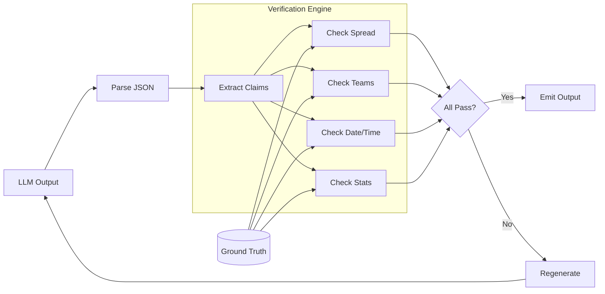

# Verification Layer

The Verification Layer is the core innovation of Specter Sports Intelligence. It solves the "hallucination problem" by ensuring every LLM output is factually correct before reaching users.

---

## The Problem

LLMs are unreliable with numbers. They will confidently state incorrect spreads, wrong team names, outdated injury statuses, and fabricated statistics. In sports analytics, this is unacceptable.

```
❌ LLM: "Lakers are 3-point favorites tonight at home..."
✓ Reality: Celtics are 7.5-point favorites, Lakers are on the road
```

## The Solution

Every generated output passes through a **deterministic verification engine** that:

1. Parses the LLM's structured JSON output
2. Queries the ground truth database
3. Compares claimed values to actual values
4. Rejects or regenerates on mismatch

---

## Architecture



---

## Verification Checks

### 1. Spread Verification

```typescript
// LLM claims: "Lakers -3.5"
// Ground truth: spread = -7.5 (Celtics favored)

if (Math.abs(claimed.spread - actual.spread) > 0.5) {
  return {
    passed: false,
    issue: `Spread mismatch: LLM said ${claimed.spread}, actual is ${actual.spread}`
  };
}
```

### 2. Team Identity

```typescript
// LLM claims: "Lakers playing at home"
// Ground truth: homeTeam = "Boston Celtics"

if (claimed.homeTeam !== actual.homeTeam) {
  return {
    passed: false,
    issue: `Home team wrong: LLM said ${claimed.homeTeam}, actual is ${actual.homeTeam}`
  };
}
```

### 3. Date/Time Consistency

```typescript
// LLM says: "Tune in Tuesday night!"
// Game date: Wednesday

const gameDay = getDayOfWeek(actual.gameTime);
const claimedDay = extractDayFromText(output.tweet);

if (claimedDay && claimedDay !== gameDay) {
  return {
    passed: false,
    issue: `Day mismatch: LLM said ${claimedDay}, game is on ${gameDay}`
  };
}
```

### 4. Statistical Plausibility

```typescript
// LLM claims: "Player averaging 45 PPG this season"
// No NBA player has ever averaged 45 PPG

if (stat.value > PLAUSIBILITY_CEILING[stat.type]) {
  return {
    passed: false,
    issue: `Implausible stat: ${stat.value} for ${stat.type}`
  };
}
```

---

## Implementation

### ValidationResult Schema

```typescript
interface ValidationResult {
  passed: boolean;
  issues: string[];
  corrected_text?: string;
}
```

### FactChecker Class

```typescript
class FactChecker {
  async validate(
    signal: { pick: string; reasoning: string; tweet_text: string },
    game: GameData,
    context: string
  ): Promise<ValidationResult> {
    const issues: string[] = [];
    
    // Check spread
    if (!this.verifySpread(signal, game)) {
      issues.push("Spread mismatch");
    }
    
    // Check teams
    if (!this.verifyTeams(signal, game)) {
      issues.push("Team identity error");
    }
    
    // Check date references
    if (!this.verifyDate(signal, game)) {
      issues.push("Date/time inconsistency");
    }
    
    return {
      passed: issues.length === 0,
      issues
    };
  }
}
```

---

## Ground Truth Database

The verification engine queries Firebase Firestore for authoritative data:

### Games Collection

```typescript
// games/{gameId}
{
  id: "nba_lal_bos_20250102",
  league: "NBA",
  homeTeam: "Boston Celtics",
  homeAbbr: "BOS",
  awayTeam: "Los Angeles Lakers",
  awayAbbr: "LAL",
  spread: -7.5,
  total: 224.5,
  homeML: -300,
  awayML: +240,
  time: "2025-01-02T19:30:00-05:00",
  status: "scheduled"
}
```

### Line Snapshots (Historical)

```typescript
// line_snapshots/{snapshotId}
{
  gameId: "nba_lal_bos_20250102",
  timestamp: "2025-01-02T12:00:00Z",
  spread: -7.0,
  total: 225.0
}
```

---

## Failure Handling

### Regeneration Loop

When verification fails, the system regenerates with the correction context:

```typescript
async function analyzeWithRetry(game: GameData, maxRetries = 2): Promise<Signal | null> {
  let lastIssues: string[] = [];
  
  for (let attempt = 0; attempt <= maxRetries; attempt++) {
    const signal = await llm.analyze(game, lastIssues);
    const validation = await factChecker.validate(signal, game);
    
    if (validation.passed) {
      return signal;
    }
    
    console.warn(`Verification failed (attempt ${attempt + 1}):`, validation.issues);
    lastIssues = validation.issues;
  }
  
  console.error(`All attempts failed for ${game.id}`);
  return null; // Fail silently, don't broadcast incorrect info
}
```

### Fail Safe

If all regeneration attempts fail, the system stays silent rather than broadcasting incorrect information:

```
❌ 3 verification failures → Skip game, log error
✓ Never broadcast unverified output
```

---

## Performance

| Metric | Value |
|--------|-------|
| Average verification time | ~50ms |
| Regeneration rate | ~8% |
| False positive rate | <1% |

---

## Related Documentation

- [Architecture](ARCHITECTURE.md) - System overview
- [ADR: Verification First](adr/002-verification-first.md) - Design decision
